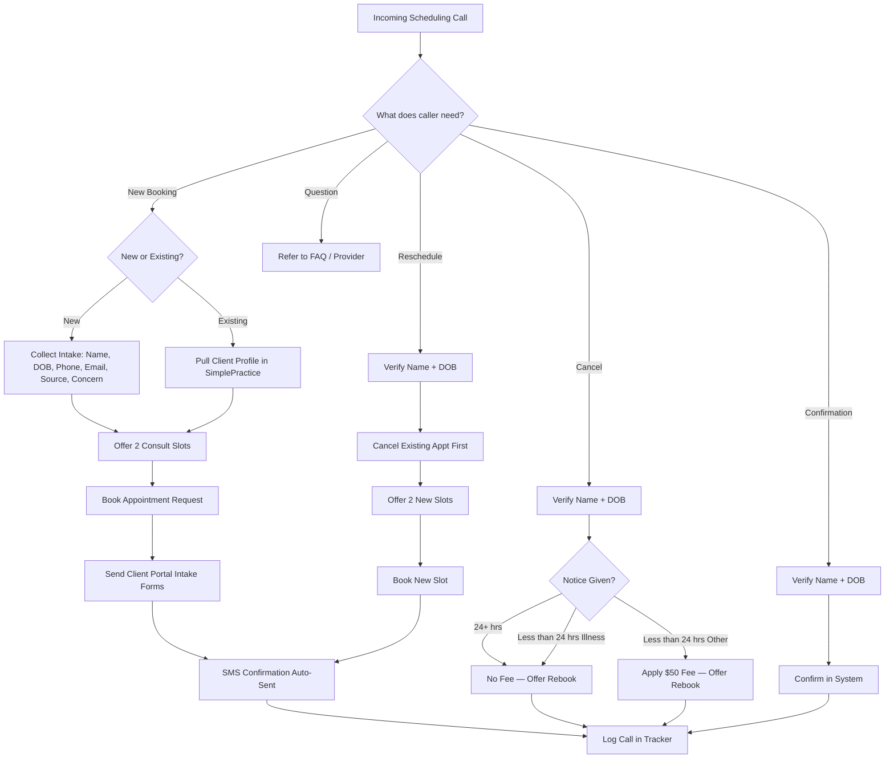

# Appointment Scheduling Workflow

**Document:** 06 — Scheduling Workflow
**Practice:** Glow Aesthetics & MedSpa (sample portfolio project)
**Prepared by:** Goodness Ajii, RN, Certified Medical Virtual Assistant
**Version:** 1.0
**Effective Date:** May 2026
**Platform Reference:** SimplePractice

> **Disclaimer:** This workflow was developed for a fictional practice as part of a portfolio demonstration.

---

## Purpose

This document defines exactly how the Virtual Receptionist schedules, reschedules, cancels, and confirms appointments for Glow Aesthetics & MedSpa. The workflow ensures:

- No empty slots from poorly-handled reschedules
- 100% of appointments confirmed before the visit
- Zero double-bookings
- Clear audit trail in SimplePractice for every change
- Smooth handoff from phone → Client Portal → Calendar

---

## 1. Master Workflow (Inbound Scheduling Call)

```
                    ┌─────────────────────────────┐
                    │   INCOMING SCHEDULING CALL  │
                    │   Greet + identify intent   │
                    └──────────────┬──────────────┘
                                   │
                    ┌──────────────┴──────────────┐
                    │   What does caller need?    │
                    └──────────────┬──────────────┘
                                   │
        ┌──────────────┬───────────┼───────────┬──────────────┐
        │              │           │           │              │
        ▼              ▼           ▼           ▼              ▼
    NEW BOOKING   RESCHEDULE   CANCEL    CONFIRMATION    QUESTION
        │              │           │           │              │
        ▼              ▼           ▼           ▼              ▼
   ┌────────┐    ┌─────────┐  ┌────────┐  ┌─────────┐   ┌──────────┐
   │ NEW or │    │ Verify  │  │ Verify │  │ Verify  │   │ Refer to │
   │ EXIST? │    │ name    │  │ name   │  │ name    │   │ FAQ /    │
   └───┬────┘    │ + DOB   │  │ + DOB  │  │ + DOB   │   │ provider │
       │         └────┬────┘  └────┬───┘  └────┬────┘   └──────────┘
       │              │            │           │
   ┌───┴────┐         ▼            ▼           ▼
   │  NEW   │     Cancel        Apply       Confirm
   │PATIENT │     existing      24-hr       in system
   └───┬────┘     → offer       policy      → SMS
       │         2 new slots    → offer     → log call
       ▼         immediately    rebook
   Collect       → log call     → log call
   intake →
   offer
   consult
   slots
       │
       ▼
   Book in
   SimplePractice
   → send Client
   Portal Intake
   Forms → SMS
   confirmation
   → log call
```

---

## 2. New Patient Booking Workflow

### Step-by-step procedure

| Step | Action | Time | System |
|---|---|---|---|
| 1 | Greet warmly using brand standard greeting | 5 sec | Phone |
| 2 | Identify caller as new (haven't visited) | 30 sec | Phone |
| 3 | Briefly describe the service of interest using FAQ | 1 min | FAQ doc |
| 4 | Collect intake info (name, DOB, phone, email, source, concern) | 2 min | Pen/paper or live entry |
| 5 | Check provider availability for the requested service | 30 sec | SimplePractice Calendar |
| 6 | Offer 2 specific time options | 30 sec | Phone |
| 7 | Once confirmed, create Client Profile in SimplePractice | 1 min | SimplePractice |
| 8 | Create Appointment Request → confirm to caller verbally | 30 sec | SimplePractice |
| 9 | Send Intake Forms via Client Portal | 30 sec | Client Portal |
| 10 | Verbal recap: date, time, provider, what to bring, cancellation policy | 30 sec | Phone |
| 11 | Sign off; log call in tracker within 5 min | 2 min | Call Log |

**Total target time:** 5–8 minutes.

### Service-specific time blocks

When booking, match the appointment length to the service:

| Service | Duration | Buffer | Notes |
|---|---|---|---|
| Consultation (any) | 30 min | 5 min | Provider-only |
| Botox / neurotoxin | 30 min | 10 min | Allow numbing time |
| Filler (1 syringe) | 45 min | 15 min | Includes consult + numbing |
| Filler (2+ syringes) | 60 min | 15 min | — |
| HydraFacial Signature | 30 min | 10 min | — |
| HydraFacial Deluxe | 45 min | 10 min | — |
| HydraFacial Platinum | 60 min | 10 min | Includes lymphatic |
| Microneedling | 75 min | 15 min | 30 min numbing + 45 min treatment |
| Laser hair removal (small area) | 15–30 min | 5 min | — |
| Laser hair removal (large area) | 45–60 min | 10 min | — |
| Chemical peel | 45 min | 10 min | — |
| RF microneedling | 90 min | 15 min | — |

---

## 3. Reschedule Workflow

### Rules

- **Always cancel + rebook in one call** — never leave the patient without a confirmed new slot.
- **Cancel the original first, then book the new slot.** Doing it in this order frees the calendar so you can offer the original time to someone on the waitlist.
- If the patient can't decide on a new time, place their request on a "Pending Reschedule" tag and follow up within 24 hours.
- Apply the cancellation/no-show policy fairly:
  - **>24 hours notice:** No fee
  - **<24 hours notice (non-illness):** $50 late fee
  - **Illness:** Fee waived; reschedule freely

### Steps

1. Verify patient identity (name + DOB).
2. Pull up the patient's Client Profile in SimplePractice.
3. Confirm the existing appointment details.
4. Cancel the existing appointment with a note: *"Patient-requested reschedule."*
5. Offer 2 alternative times with the same provider where possible.
6. Book the new appointment.
7. Verbally recap the new appointment.
8. Send updated SMS/Client Portal confirmation.
9. Log the call.

---

## 4. Cancellation Workflow

### Steps

1. Verify identity.
2. Pull up the appointment.
3. Apply cancellation policy:
   - >24 hrs → no fee
   - <24 hrs → $50 fee (note in chart; office manager processes)
   - No-show → $100 fee
   - Illness → waive fee
4. Offer to rebook now: *"Would you like me to find another time that works?"*
5. If declined, ask: *"Would it be okay if we reach out next week to find a time that works better?"*
6. Cancel in SimplePractice with reason code.
7. Log the call.

### Decision Tree — Late Cancel Policy

```
Patient cancels appointment
        │
        ▼
Notice given?
   │
   ├── ≥ 24 hours ──────────────► No fee. Reschedule freely.
   │
   ├── < 24 hours, illness ─────► Waive fee. Reschedule freely.
   │
   ├── < 24 hours, non-illness ─► $50 fee applied.
   │                              Note in chart.
   │                              Office Mgr reviews.
   │
   └── No-show (no contact) ────► $100 fee applied.
                                   Note in chart.
                                   Office Mgr reviews.
                                   Patient flagged for next-time
                                   prepay required.
```

---

## 5. Confirmation Workflow (Outbound)

### Cadence

| When | Channel | Message Type |
|---|---|---|
| **At booking** | SMS + email | Auto-confirm via SimplePractice |
| **48 hours before** | SMS | Auto-reminder via SimplePractice |
| **24 hours before** | Phone call | Manual call only if patient hasn't confirmed via SMS |
| **2 hours before** | SMS | Auto-reminder for same-day prep |

### Manual confirmation script

> "Hi [First Name], this is Goodness from Glow Aesthetics. I'm calling to confirm your appointment with [Provider] on [Day, Date] at [Time]. Please reply or call back at (305) 555-0140 if you need to make any changes. We look forward to seeing you!"

### What to flag during confirmation calls

- Pre-care reminders specific to the service (e.g., no NSAIDs, no alcohol)
- New patient intake forms not yet completed → resend Client Portal link
- Upcoming travel that conflicts with post-care requirements
- Any mentions of new medications, illness, or pregnancy → flag for provider review

---

## 6. Same-Day & Walk-In Handling

### Same-day cancellation freeing a slot

1. Update calendar in SimplePractice (cancel + add note).
2. Check the **waitlist** (Pending Reschedule + standby tags).
3. Call top 3 candidates in priority order:
   1. Members (Glow VIP first, then Glow)
   2. Patients flagged "wants earlier slot"
   3. Most recent reschedules
4. Fill the slot or release it.
5. Log all outreach.

### Walk-in inquiry (in-person at clinic)

The VA does not handle in-person walk-ins, but if a patient calls *while at the clinic* asking about same-day availability:

1. Check live calendar.
2. If a slot exists, ask the patient to check in with the front desk and confirm with the provider.
3. Add the patient to SimplePractice as a "same-day" appointment.
4. Slack `#front-desk` to notify in-office staff.

---

## 7. Provider-Specific Booking Rules

| Provider | Service Restrictions | Booking Notes |
|---|---|---|
| **Dr. Sarah Chen, MD** | Complex cases, second opinions | Books only via Office Manager |
| **Jamie Rodriguez, RN** | Botox, filler, Sculptra, Kybella | Lead injector; books out 2–3 wks |
| **Aisha Patel, RN** | Botox, filler, lip enhancement | Newer patients welcome |
| **Maria Lopez, LE** | HydraFacial, microneedling, peels, dermaplaning | No injectables |
| **Laser tech (rotation)** | Laser hair removal, IPL | Tue/Thu/Sat only |

---

## 8. Pre-Care Reminders (Send at Booking)

Send service-specific pre-care via Client Portal at the moment of booking:

| Service | Pre-Care Sent at Booking |
|---|---|
| Botox / Neurotoxin | Avoid NSAIDs, alcohol, fish oil 24–48 hrs prior. Avoid intense exercise day-of. |
| Filler | Same as above + arrive with clean skin (no makeup ideal). |
| Microneedling | Stop retinol 5–7 days prior. No active sunburn. Arrive 30 min early for numbing. |
| Laser Hair Removal | Shave the area 24 hrs prior. No sun/tanning 1 wk prior. No plucking/waxing 4 wks. |
| Chemical Peel | Stop retinol 7 days prior. No recent sun exposure. |
| HydraFacial | No special prep. Arrive with clean face if possible. |

---## 9. Workflow Diagram (Mermaid Format)



---

## 10. KPIs for Scheduling Performance

| KPI | Target | How Measured |
|---|---|---|
| Same-call resolution (booking handled in one call) | ≥ 95% | Call log entries with "Booked? = Y" / total bookings |
| Conversion rate (new caller → booked) | ≥ 60% | New-patient bookings / new-patient inquiries |
| Average booking call length | 5–8 min | Call log timestamps |
| No-show rate | ≤ 5% | SimplePractice no-show tag |
| Late cancellation rate (<24 hrs) | ≤ 8% | SimplePractice cancellation reason codes |
| Reschedule conversion (rebooked same call) | ≥ 90% | Call log "Booked? = Y" on reschedule entries |
| 48-hr SMS confirmation completion | 100% | SimplePractice automation report |

---

## Document Control

| Field | Detail |
|---|---|
| **Author** | Goodness Ajii, RN, Virtual Receptionist |
| **Created** | May 2026 |
| **Last Reviewed** | May 2026 |
| **Review Cadence** | Quarterly |

---

*End of Scheduling Workflow*
